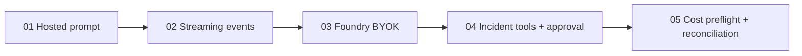
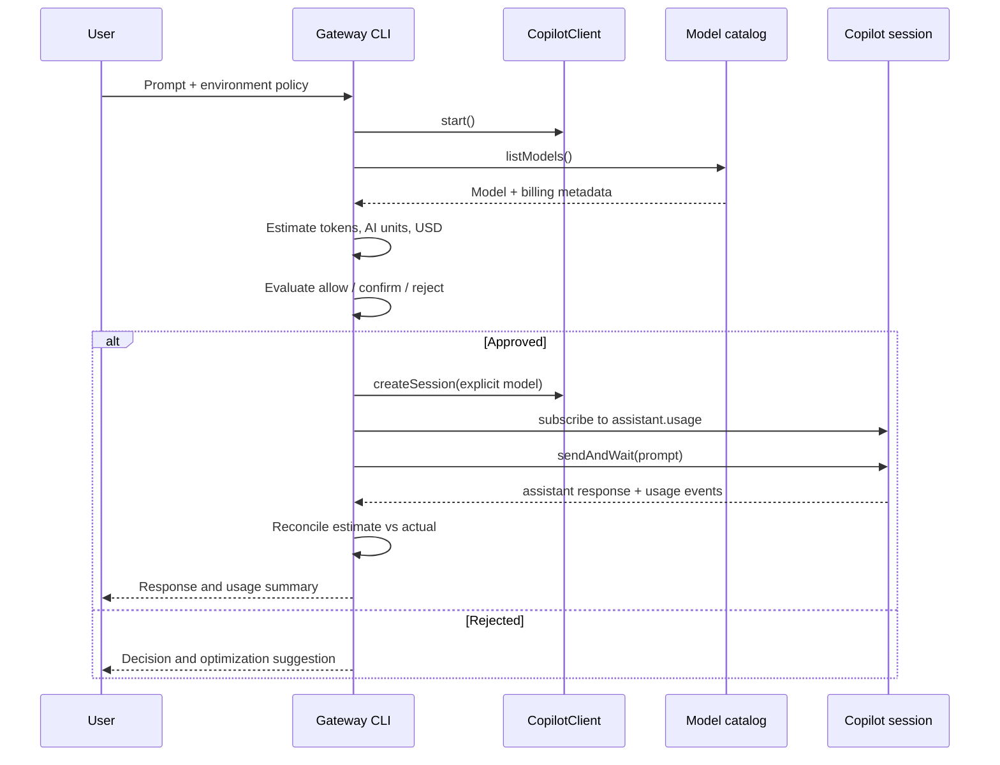

# Architecture and data flow

## Repository progression

## Cost gateway flow

## Safety boundaries

- The gateway creates a session only after approval.
- The incident demo exposes narrow custom tools and keeps mutation in application code.
- `.env` and generated Copilot state are ignored.
- Estimates are labeled as estimates; actual usage is collected from live SDK events.
- The sample USD conversion is configurable and must be replaced by an approved organizational accounting rate.
